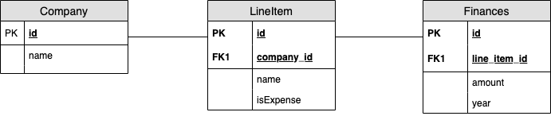

# Notes
- I have used sqlite db to store relational data.
- Assumptions about pdf format

  I have exracted the text from pdf file with pdf2text and then have assumed following things in order to parse the data
  1. The Balance sheet information is present on the first page of the pdf. And only the first page will be considered for text processing.
  2. First non empty row content is considered to be company name.
  3. There is a row that contains 'Particulars' word that separates the company info from balance sheet line items. After   'Particulars' every row may have line items.
  4. Then for every line item row, it can have zero or more columns.
  
- Parsing Algorithm

    1. Parsing logic is based on how many number are present of the format (123.00) in row. For now, I have considered two decimal places only. But it can be extended to a genralized format.
    2. Once, we determine how many numbers are present there can be three cases.
        * 0 numbers means empty line
        * 2 numbers means either left line item is present or right line item is present.
        * 4 numbers means both line items are present or it is a total row
            
            1. if a entry is present which start with `To ` then there are line items in row. so extract each line item.
            2. If not, it is a total row then extract the patterns starting with `Total`.
            
  
```
NOTE:- The applications assumes that data parsed from pdf under above assumptions is valid 
and it will insert in the database. There are no secondary validations before inserting the data 
to the database.
```

# Run Book

- script to convert pdf to csv is located at script/script.py.

  Dependency for script is pdf2text. Please make sure it is available to script.
  Run it with `python3 script.py -f /path/to/pdf/file`
  It will produce the csv in current directory.


- App providing upload and download capabilities

  make sure docker-compose is available on your system
  and then run `docker-compose up`. Now, access the app on `http://localhost:8000/`

# E-R Diagram

